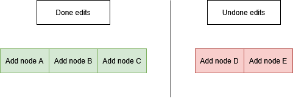
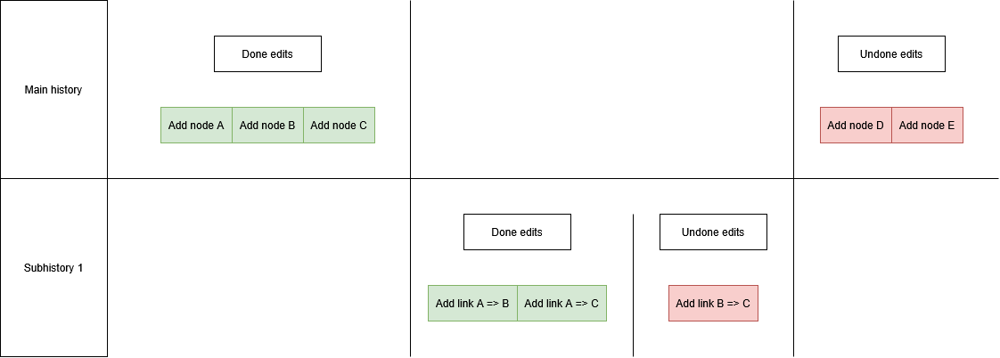
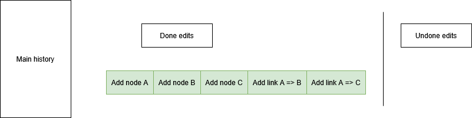
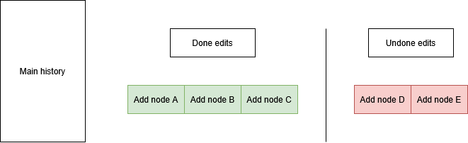

The ``Edit History`` registers the edits the user has done, allowing him to undo the actions they 
took, or to re-apply them. Internally, the ``Edit History`` is implemented as two stacks, one for 
edits that have been done, and other for the edits the user has undone. 

For example, if we had a network and we added 5 nodes via ``AddNodeEdit``, having nodes ``A``, 
``B``, ``C``, ``D`` and ``E``, and then undid the last two edits, we would have a network with 
``AddNodeEdit`` that were done (``A``, ``B``, and ``C``) and two ``AddNodeEdit`` undone (``D`` and
``E``), looking like this:

If we were to execute ``redo`` at this point, we would ``redo`` the left-most edit in the Undone-stack, 
meaning we would have ``D``, back in the network. If we were to execute ``undo`` instead, we would 
``undo`` the right-most edit in the Done-stack, meaning we would remove ``C`` from the network.

The ``redo`` operation can be triggered by calling ``probNet.getPNESupport().redo();``, and ``undo`` 
operation by calling ``probNet.getPNESupport().undo();``.

When **executing**[^1] an edit, the edit is pushed to the right of the done-stack, and the undone-stack
is cleared. 

# Stacked histories
The ``Edit History`` can be stacked with subhistories that aren't commited, which allows you to 
create a subhistory of edits that you can commit or uncommit later.

This comes extremely useful when developing a GUI that can trigger multiple edits at once, but you 
want to allow the user to cancel the actions they took on said GUI.

## Example

Say we have done the edits we said earlier, were we created nodes ``A``, ``B``, ``C``, ``D`` and
``E``, and we undid the last two edits, resulting in this history:

We can now create a new subhistory via ``probNet.getPNESupport().openNewSubEditHistory();``, and we
add three links (``A`` => ``B``, ``A`` => ``C``, ``B`` => ``C``) and undid the last one. This would
result in the following history stack:

To commit the subhistory, we can call ``probNet.getPNESupport().closeSubEditHistory();``, which
would take the done edits from the subhistory and push them to its parent history (the main one in
this case) and also removing the undone edits from the parent and removing the subhistory from the 
stack, resulting in this:

If instead of committing the subhistory, we would have uncommited it via 
``probNet.getPNESupport().cancelLastSubEditHistory();``, then the done edits (The links ``A`` => ``B``,
``A`` => ``C`` and ``B`` => ``C``) would be ``undone``, and the subhistory would have been removed.
This means it is as no change was done, as the subhistory was never committed, returning to the 
state before calling ``probNet.getPNESupport().openNewSubEditHistory();``, which is:

As you might have noticed, we are always working on the last subhistory in the stack, which means it
is impossible to alter any previous subhistory until the current history is commited. This prevents
you from accidentally[^2] altering a parent history.

[^1]: This behavior only happens in the ``execute`` method of ``PNEdit``, but not when calling 
``probNet.getPNESupport().redo();``. This means ``redoing`` does not clear the undone-stack.

[^2]: In previous versions of OpenMarkov, the concept of subhistories didn't exist, and a system of 
parentheses was used, which allowed you to alter the parent histories, which you should not do in 
any circumstances.