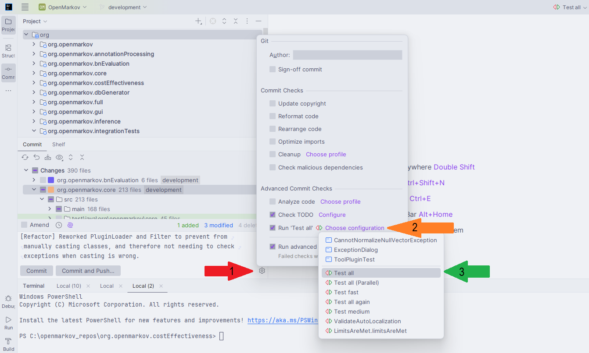

# Working methodology #

[//]: # (A link comes to this page saying mainly: pull before push, don't hardcode strings and use
Eclipse code style)

### Importing Eclipse's code style in IntelliJ
In IntelliJ all you need is to export settings from Eclipse (go to Eclipse’s preferences → Java
→ Code Style → Formatter and export the settings to an XML file via the Export All button.), 
then open IntelliJ IDEA Settings → Code Style → Java, click the Settings button, and import that XML
file using the Import scheme option.

## Getting started with Git

OpenMarkov's code is stored in Bitbucket using Git as the control version system. 

Atlassian, the company that hosts the Bitbucket repositories, offers a 
[tutorial](https://www.atlassian.com/git/tutorials/learn-git-with-bitbucket-cloud) that explains the
basic operations with Git. 

The basic operations are the following:

* __Commit__ generates a changeset locally, a version of the repository, so to say. 
* __Push__ is used to submit these changesets to the central repository. The "Team Synchronize" of
Eclipse shows the changesets waiting to be submitted; they are marked as "Outgoing." 
To upload your changes to the central repository, you will have to do both operations, Commit and Push.
* __Pull__ downloads the changesets from the remote repository to your local repository. 
* __Update__ updates the copy in the local working directory with the changesets we pulled.

For simplicity, we will assume that the Git client you are using (in general, you will use the 
client included in your IDE) is configured to perform an update after every pull. 
For this reason in the rest of this document we will just say "pull" instead of "pull and update".

Therefore, when you wish to upload to Bitbucket's server the changes you have made, the correct 
workflow is as follows:

1. Pull
2. Resolve conflicts, if any
3. Commit
4. Push

## Daily work with OpenMarkov

The first thing a developer should do every day before working on OpenMarkov's code is to download 
the latest changes from the central repository. To do this, just right-click on the Eclipse project 
and go to Team > Pull. The first time you do it you will need to specify the URL of the Bitbucket 
repository and your user information. Leave the box "Update after Pull" checked. If you wish to see
the changesets you are going to download, click "Next"; otherwise, click "Finish".

Once you do this, there might be conflicts (i.e. a file that you have changed has been changed by
some other user and submitted to the central repository). This conflicts will be marked in red in 
the "team synchronize view" (right click on the Java project and go to Team > Synchronize).

Go through the files that have conflicts by double-clicking on them (and clicking "No" on the pop 
up). You'll see a comparison between the local and remote versions of the file so that you can 
download the changes in the remote version without losing your changes. Check that resulting code 
should compile and pass the jUnit tests. Once we are done with the conflict resolution, we have to 
right click on the files and choose "Mark as resolved".

## Submiting code changes to the central repository

Before submitting any local change to the server, the developer must pull the latest changes from 
the server first. After doing so, they might need to resolve the conflicts as explained in the 
previous version. 

Once the latest changes have been pulled and all the conflicts resolved, the developer can proceed 
to commit (Team > Commit) the local changes. Please write a short but clear description of the 
changes contained in the changeset you are about to commit. Committing will generate a changeset 
that should immediately be pushed (Team > Push) to the central repository. 

In case some changeset is pushed since the last time a developer pulled and she has already
committed a changeset, the push will fail. To solve this, a pull must be done, which will then cause
a conflict with the commits of the developer. Select "rebase on tip" and resolve the conflicts 
(if any) comparing the local version with the commited versions of the conflicting file. Once the
conflicts have been resolved, mark them as such, commit the changes done during the conflict 
resolution, and push them all.

It is not allowed to force a push without having resolved the conflicts because it may damage the
work of other developers.

Before committing and pushing code, the developer should also check all tests are passing. This can
be automated so every time you push 'commit', the tests will execute, and if they failed the commit
will be cancelled. For automating it, open the ```Commit``` tab and click on the cog (1), then 
select to run a custom configuration (2 and 3). The 'Test all' configuration is one for checking
every test in OpenMarkov, and you can check that one in 
[here](Testing.md#executing-only-fast-tests).

