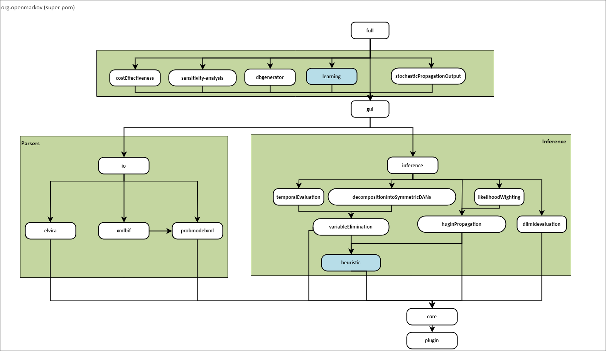
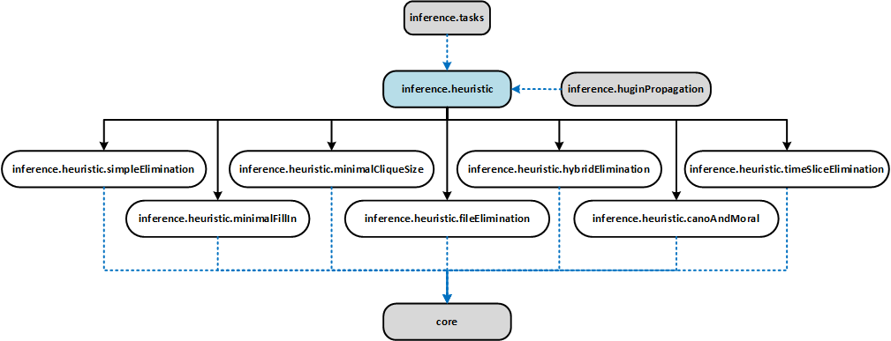
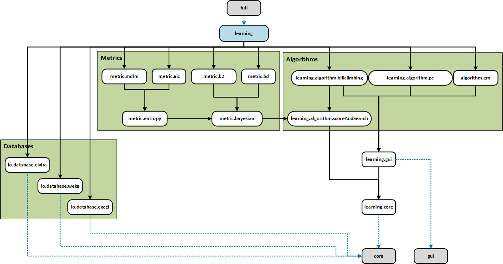

# OpenMarkov's organization

OpenMarkov is structured as a set of __subprojects__. The division has been designed so that 
dependencies are minimized and the application can be easily extended. Each subproject is stored in
a different Bitbucket repository and deployed as a Maven artifact on our Nexus server, as
explained below.

## Maven dependencies
OpenMarkov consists of a series of subprojects that follow the next structure:

The packages "heuristic" and "learning", colored in blue, comprise several _subprojects_.

"Heuristic" contains all the heuristics implemented in OpenMarkov:

The "learning" package contains the learning algorithms, the metrics, and the graphical user 
interface for automatic and interactive learning.

## Servers

The code is stored in two servers: 

- [Bitbucket (bitbucket.openmarkov.org)](http://bitbucket.openmarkov.org)
- [Nexus (nexus.openmarkov.org)](http://nexus.openmarkov.org).

### Bitbucket

[Bitbucket](https://bitbucket.org) is a web-based hosting system, similar to SourceForge, 
JavaSource, GitHub, or Google Code. 

It offers the version control system of [Git](https://git-scm.com/). It also offers wikis, issue 
trackers, and other facilities.

We use Git to store in Bitbucket a __working copy__ of OpenMarkov's Java source code, as well as 
this wiki and an [issue tracker](http://issues.openmarkov.org).

### Nexus

[Nexus](http://nexus.sonatype.org) is an application for managing software repositories.

We use [Maven](http://maven.apache.org) to __deploy__ OpenMarkov's code in our nexus server, 
[nexus.openmarkov.org](http://nexus.openmarkov.org), in the form of snapshots and stable releases.

This repository contains a .jar file for each subproject. The .jar file for the subproject "full" 
includes all the other .jar files and allows the user to run OpenMarkov's GUI as a Java application.

The "full" subproject can also be downloaded from the [users' page](http://www.openmarkov.org/users.html).

If you wish to browse OpenMarkov's code or use it as an API,
[**install an IDE**](Setup_OpenMarkov_code/Installing_an_IDE.md) and then
[**download the repositories**](Setup_OpenMarkov_code/Download_OpenMarkov's_Repositories.md).