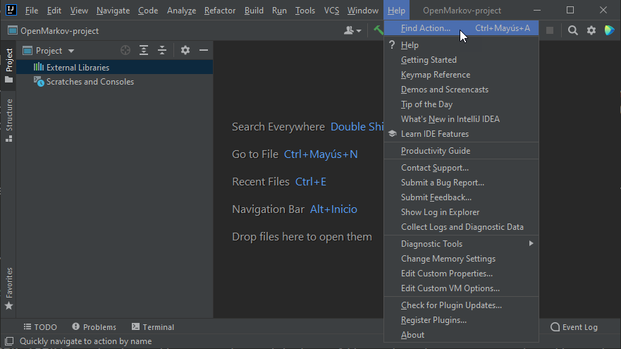
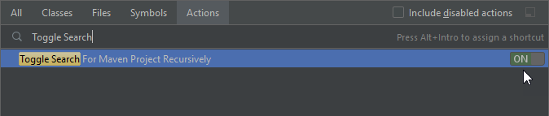
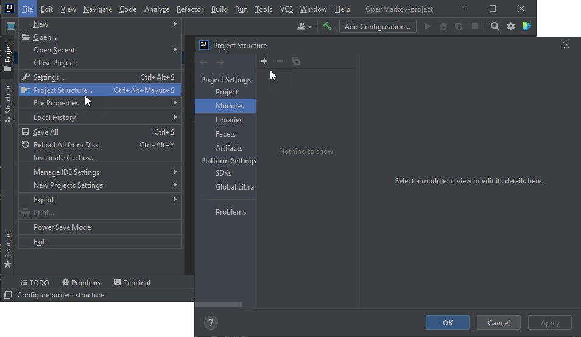
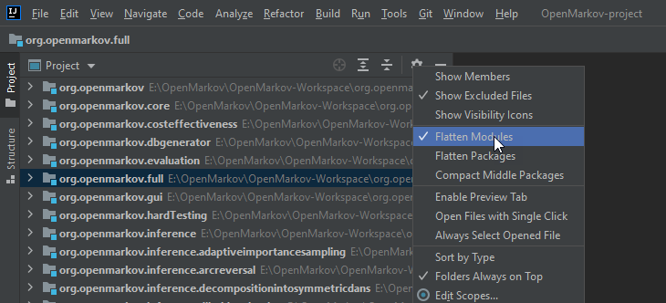
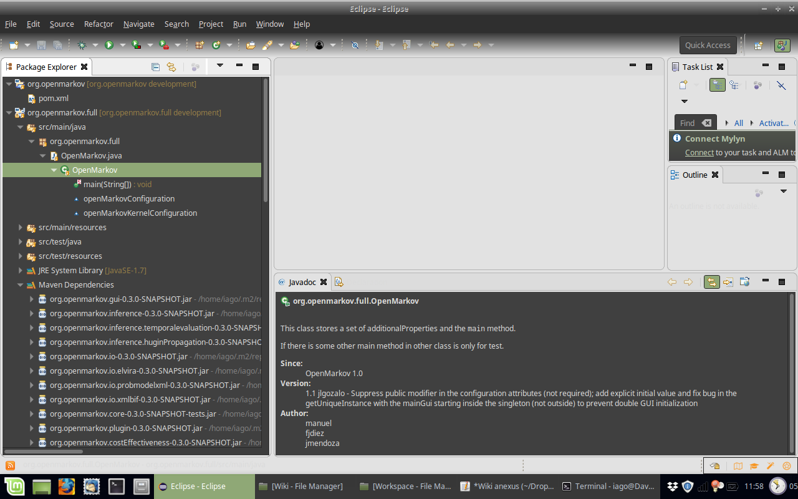

## Downloading OpenMarkov's repositories

At this point, you are supposed to have a working IDE and Git in your computer; if not, go back and [install them](https://bitbucket.org/cisiad/org.openmarkov/wiki/Install_IDE).

You have to download every repository you want to browse plus these two: *org.openmarkov*, which is like the front door of OpenMarkov; and *org.openmarkov.full*, which acts as the corridors to the other Maven repositories.

You can download all repositories with this script:

```
git clone -b development https://github.com/OpenMarkov/root
git clone -b development https://github.com/OpenMarkov/annotationProcessing
git clone -b development https://github.com/OpenMarkov/core

git clone -b development https://github.com/OpenMarkov/full  

git clone -b development https://github.com/OpenMarkov/bnEvaluation
git clone -b development https://github.com/OpenMarkov/costEffectiveness
git clone -b development https://github.com/OpenMarkov/dbGenerator
git clone -b development https://github.com/OpenMarkov/gui
git clone -b development https://github.com/OpenMarkov/hardTesting
git clone -b development https://github.com/OpenMarkov/inference
git clone -b development https://github.com/OpenMarkov/integrationTests
git clone -b development https://github.com/OpenMarkov/io
git clone -b development https://github.com/OpenMarkov/learning.algorithm
git clone -b development https://github.com/OpenMarkov/learning.core
git clone -b development https://github.com/OpenMarkov/learning.gui
git clone -b development https://github.com/OpenMarkov/learning.metric
git clone -b development https://github.com/OpenMarkov/resttemplate
git clone -b development https://github.com/OpenMarkov/stochasticPropagationOutput

git clone -b development https://github.com/OpenMarkov/sensitivityAnalysis
echo "Finished cloning"
```


If you don't want to download all the repositories, simply delete them from the previous script. You have a [list](https://bitbucket.org/cisiad/org.openmarkov/wiki/resources/repositories) to help you choose. 

The script will clone from the **development** branch. Once over, import your local copy into your IDE. We explain how to do it for IntelliJ and Eclipse.


### 1a. Importing OpenMarkov into IntelliJ

Open IntelliJ, select "New project", and create a new empty project. Once the project is created it is necessary to activate the recursive search when importing Maven projects. You can do it by selecting "Help > Find Action", entering "Toggle Search" in the search field, and ensuring the switch is set to "ON".





Now, we are ready to import the Maven projects as modules of our project. Open the project structure ("File > Project Structure"). Select the plus icon under the modules view, select the option "Import Module" and the folder in which you downloaded the OpenMarkov projects. 



As we activate the recursive search of Maven projects when importing, we only need to select the folder in which we downloaded all the Maven projects. Select "Import module from external model" and Maven (as external model), and click Finish.

Now you should see every repository you downloaded as modules of the project.


#### Setting the path for the JDK

The next step is to configure the Project SDK. In the "Project Structure" window, select the "Project" menu on the left and select the Java Development Kit (JDK, also known as SDK), you want to use (or download a new JDK). 


Once the project configuration is done, press "OK" button on the Project Structure dialog. Once IntellIJ imported all modules, you can navigate for the OpenMarkov's structure by selecting the "Flattern Modules" option (by clicking the gear icon on the project panel)



<!--
#### Setting the location of the repositories

Newest versions of IntelliJ do this automatically, so if you don't get this message skip this section. Older ones might show a message (on the right lower corner) complaining about invalid VCS mapping³. That is because OpenMarkov's code is not in the folder `/OpenMarkovMainFolder` itself, but in its subfolders. 

Expand the message, click "Configure", mark the two OpenMarkov repositories shown, add them with the "+" button, and remove the `/OpenMarkovMainFolder` folder with the "-" button. The screen will look like this:


Close that window. Press Ctrl+E and choose "Maven Projects" in order to show the Maven hierarchy. You must see something like:


As a final test, right click on the *OpenMarkov.java* file and click "Run".
-->


#### Troubleshoot

If IntelliJ is unable to locate your JDK (the version you already installed) you are can search for its location manually. It will likely be in one of these folders:

- __Windows:__ `Program Files/Java`

- __Linux:__ `/usr/lib/jvm/java-1.8.0-openjdk-amd64`

<!-- OpenMarkov may fail to run prompting an error in the lines of: `package org.openmarkov.gui.configuration not found`. If it happens, go to the file *pom.xml* inside the folder *org.openmarkov.full* and comment the dependence of *sensitivityanalysis* (as in the right side of the following image).

 -->

If there are any projects with problems in their pom.xml files, try to reload all Maven projects (in the Maven tab at the right side of the IDE click the "Reload all Maven Projects" button).


### 1b. Importing OpenMarkov into Eclipse

Open Eclipse and import the project (File > Import > Maven > Existing Maven Projects). Then select the `/OpenMarkovMainFolder` folder and click "Finish". You will see something like this:



As a final test, right click the *OpenMarkov.java* file and run it (Run > As Java Application).


---

### Adding a new module to OpenMarkov

If the CISIAD added a new module (subproject) to OpenMarkov or you didn't download some of them and you want them now. Here is how to add a new module to a project (OpenMarkov in particular) in Eclipse and IntelliJ. By module, I refer only to CISIAD-approved modules, the ones in the cases stated before:
- new OpenMarkov subprojects added by the CISIAD team or
- subprojects of OpenMarkov that you didn't download in the first time.
These subprojects are already integrated with Maven while a custom/external subproject will need Maven integration and that will not be covered here.

#### Download with Git ####

The first step is going to the OpenMarkov working directory and open there a terminal/Git Bash. Then clone the wished repositories using the git command:
```
git clone -b development http://bitbucket.org/cisiad/org.openmarkov.<modulename>
```
for every repository you want to add.


#### IntelliJ IDEA ####

To add a new module open File -> Project structure and navigate in the lateral menu to Modules. Now look for a *+* symbol in the top-left corner and click it. Choose "Import module". From here the steps the same as those of the [first download](https://bitbucket.org/cisiad/org.openmarkov/wiki/First_download). Those are:

1a. [*Few modules*] For every module: choose the folder that contains the module. *Next*. Choose "Maven" as external model. *Next*. Then accept the default options until you click *Finish*.

1b. [*A lot of modules*] In this case it is better to choose the folder that contains all subprojects (which is the OpenMarkov working directory). *Next*. Choose *Maven* as external model. *Next*. And in the final screen, select only the subprojects that you wish to import (navigation through this list is easier using arrows and **Spacebar** to check/unckeck projects). Click *Finish*.

The subprojects will be added and automatically ordered in the package tree (you might need to click on them to actually see that).

#### Eclipse ####

Eclipse doesn't treat different projects from modules so the importing process is the same as in the [first download](https://bitbucket.org/cisiad/org.openmarkov/wiki/First_download), which is:

1. Select File -> Import
2. Choose *Existing Maven Projects*
3. Select as root directory the OpenMarkov working directory
4. Eclipse will recognize which subprojects are new and check only those, so clicking *Finish* get the things done.


____________________________

 1. If it is the first time you open IntelliJ, it will ask you about installing plugins. You don't need to mark anyone as the default configuration is enough to run OpenMarkov.

 2. If Windows blocks you for any reason (for example, because it is unable to access the folder `/OpenMarkovMainFolder`) run IntelliJ as administrator.

 3. If you closed this message don't worry, it will reappear eventually.
