# Installing plugins in IntelliJ

1|2|3. Go to ``File/Settings/Plugins``.  4. Introduce the name of the plugin and search for it
on the search bar.  5. When you found your desired plugin, click on ``Install``.

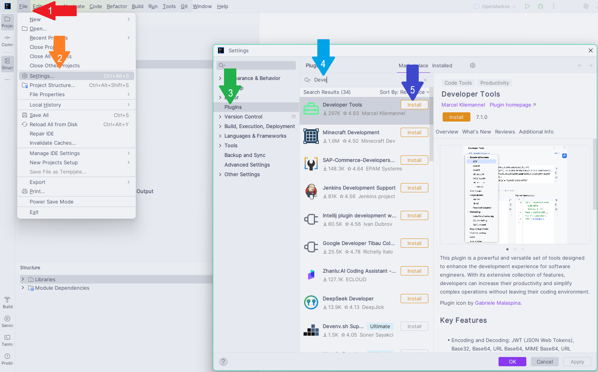

# Visual reading

This is a series of plugins aimed to improve visual reading of code, mostly by adding colors to the
code editor to differentiate elements of the code.

## Catppuccin theme

This theme allows you to differentiate between tokens inside your code, such as classes, variables,
values, or Java's keywords. For this, it just colors them with different colors from a pastel
palette.

In the table below you can see some code, where IntelliJ's default theme applies the same color for
variables, classes, method calls and generic parameters, while Catppuccin uses different color for
all of them:

| IntelliJ's Classic light theme                                                                    | Catppuccin theme                                                                                |
|---------------------------------------------------------------------------------------------------|-------------------------------------------------------------------------------------------------|
|  | 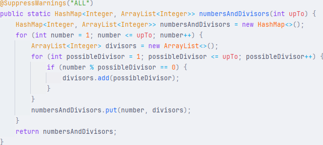 |

- [Link to Catppuccin theme for IntelliJ](https://plugins.jetbrains.com/plugin/18682-catppuccin-theme).
- There are other themes that also differentiate between tokens, such as
  [One Dark Theme](https://plugins.jetbrains.com/plugin/11938-one-dark-theme),
  [Material theme](https://plugins.jetbrains.com/plugin/8006-material-theme-ui),

## Rainbow brackets

When working with nested grouping elements, such as parentheses ``( )``, braces ``{ }``, square
brackets ``[ ]`` or tags ``< >``, it can turn troublesome to know where they start and where they
end.

The following table shows you a complex expression with many parentheses, so many that is hard to
read, and at the right you can see how ``Rainbow brackets`` renders them, where it colors grouping
elements differently depending on how nested they are:

| No Rainbow Brackets                                                                                     | Using Rainbow Brackets                                                                              |
|---------------------------------------------------------------------------------------------------------|-----------------------------------------------------------------------------------------------------|
|  |  |

This becomes invaluable when working with very nested code:

| No Rainbow Brackets                                                                               | Using Rainbow Brackets                                                                          |
|---------------------------------------------------------------------------------------------------|-------------------------------------------------------------------------------------------------|
| 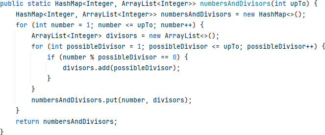 | 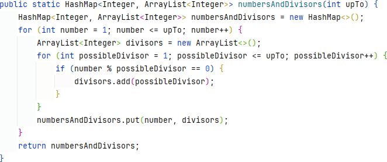 |

- [Link to Rainbow Brackets for IntelliJ (Freemium version)](https://plugins.jetbrains.com/plugin/10080-rainbow-brackets).
- [Link to Rainbow Brackets for IntelliJ (Free version)](https://plugins.jetbrains.com/plugin/20710-rainbow-brackets-lite--free-and-opensource).

## Indent Rainbow

This plugin adds visual indicators over the indentation of your code, alleviating you when following
highly indented and nested code:

| No Indent Rainbow                                                                             | Using Indent Rainbow                                                                        |
|-----------------------------------------------------------------------------------------------|---------------------------------------------------------------------------------------------|
| 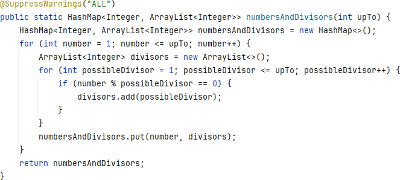 | 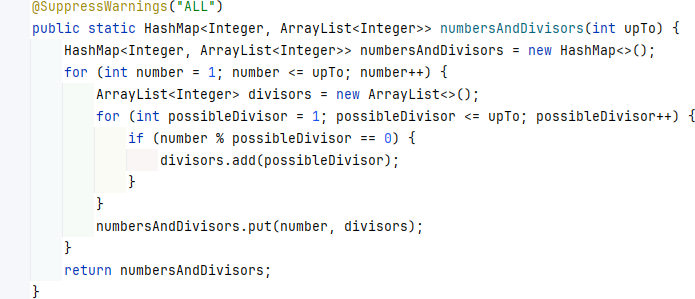 |

\* There is a similar functionality to ``Indent Rainbow`` inside ``Rainbow Brackets``, but that one
is a paid feature.

- [Link to Indent Rainbow for Intellij](https://plugins.jetbrains.com/plugin/13308-indent-rainbow);

## Final comparison

When using the three previous plugins, visualization of code can improve.
Although, the first time using it can become a bit overwhelming.

| Classic IntelliJ                                                                                                                              | Catppuccin theme + Rainbow brackets + Indent Rainbow                                                                                        |
|-----------------------------------------------------------------------------------------------------------------------------------------------|---------------------------------------------------------------------------------------------------------------------------------------------|
| 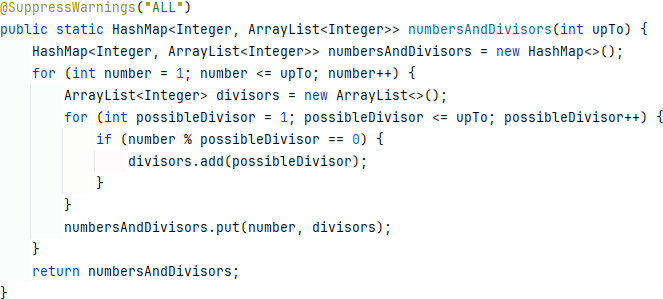 | 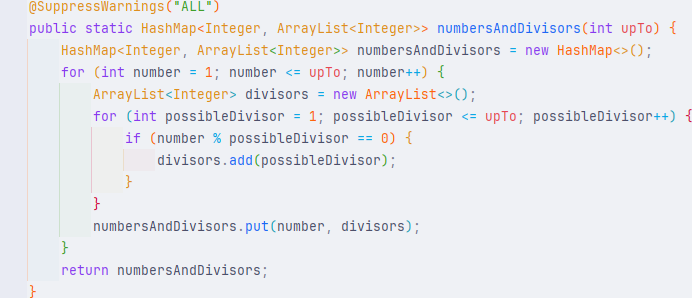 |

# CPU Usage Indicator

This shows how much of the CPU is being used by the IDE, which makes it perfect in freeze cases to
notice whether the cause is the IDE or the System itself.

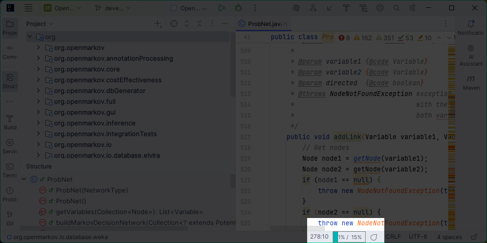

- [Link to CPU Usage Indicator for Intellij](https://plugins.jetbrains.com/plugin/8580-cpu-usage-indicator);

# Datagraph (Free for small data)

Renders a graph view out of multiple data-format documents, such as XML, JSON or YAML, although this
is only free for small/medium documents, being paid for bigger files:

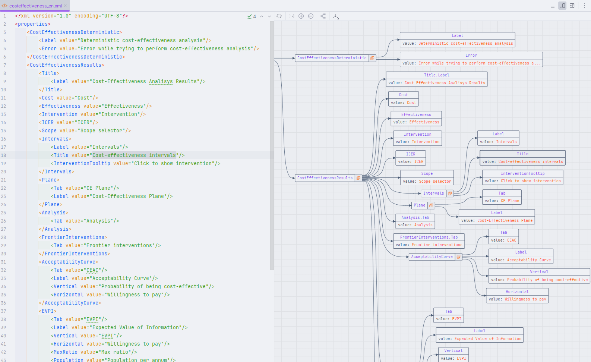

- [Link to Datagraph for Intellij](https://plugins.jetbrains.com/plugin/22472-datagraph);

# Full Line Completion (Paid)

Is part of the Paid versions of JetBrains' IDEs, and it suggests entire lines of code regarding both
what you have written and the surronding code.

In the following image, the grayed-out code is a suggestion:

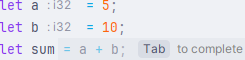